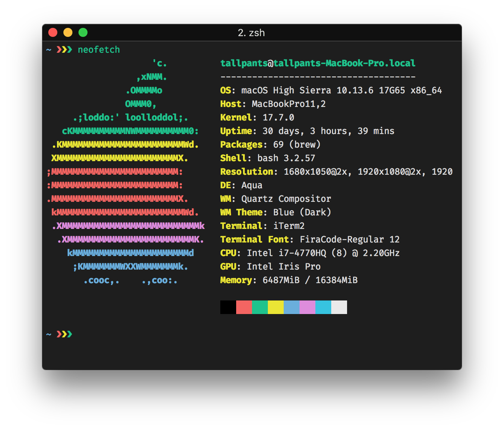

# VS Code theme for iTerm2

A color scheme for iTerm2 that matches the color scheme of Visual Studio Code's integrated terminal.

## Installing

* Download the `vscode.itermcolors` file from this repository's root.
* Go to iTerm2 > Preferences > Profiles.
* Select the Colors tab.
* Click the "Color Presets" dropdown, scroll down and select "Import", then import the `vscode.itermcolors` file.
* Click the "Color Presets" dropdown again and select the "vscode" preset.
